개요
==

이 프로젝트는 Robert C. Martin의 Clean Coders Screen Cast 중 Episode 10. OCP(Open but Closed Principle)에서 사용된 예제를 가지고 어떤 문제가 있는지, 어떻게 해결할 수 있는지를 짧은 변경 단위로 커밋하여 보여준다.
이 예제에서는

- Function Should Do One Thing
- SRP(Single Responsibility Principle)
- Feature Envy
- OCP(Open but Closed Principle)

등을 준수하는 방법을 아래와 같은 기법을 통해 보여준다.

- Extract Variable / Field / Method / Class / Interface
- Inline Variable
- Rename
- Change Signature
- Create a Field for Parameter
- Move Method
- Safely Delete
- Replace Type Code with Subclasses
- push members down

예제에서는 IDE로 intelliJ를 사용한다.

# 1. 문제

### 1.1 Function Should Do One Thing 위반

-  함수가 너무 크고, 
-  중복도 존재(*xx / 100*)
-  작은 메소드들로 추출(extract)할 필요가 있다. 
-  [Composed Method Pattern](http://c2.com/ppr/wiki/WikiPagesAboutRefactoring/ComposedMethod.html), [Extract till drop](http://www.cleancoders.com/codecast/clean-code-episode-3/show) 규칙에 따라 extract method를 수행

### 1.2 SRP 위반
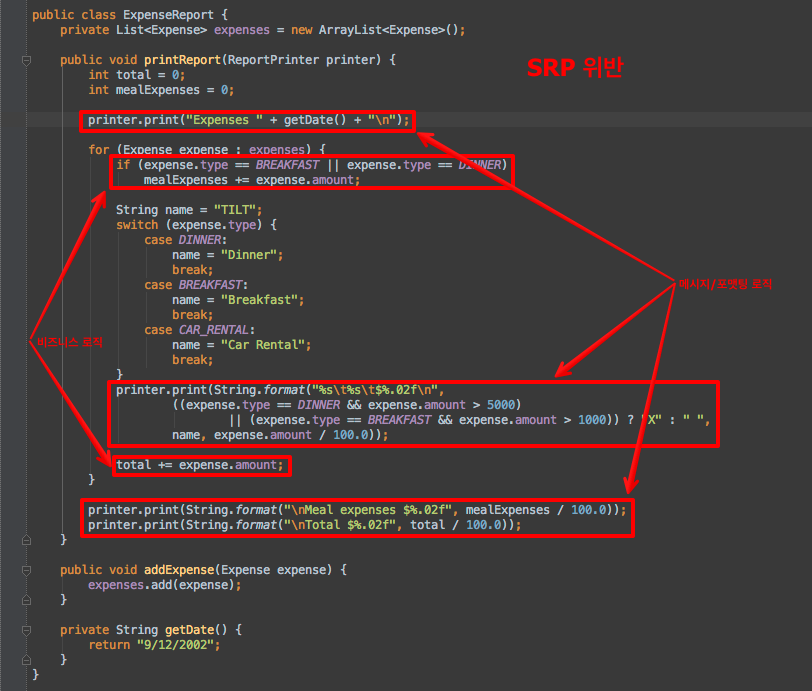

-   비즈니스 로직(비용 계산 로직)과 메시지/포맷팅 로직이 섞여 있다.
-   한가지가 아니라 여러가지 이유로 변경이 필요한 경우가 발생한다.

### 1.3 OCP 위반

-   비지니스 규칙을 확장하고자 한다면 이 모듈을 수정해야 한다.
-   메시지와 포맷팅을 변경하고자 한다면 이 모듈을 수정해야한다(위 그림에서 붉은 박스처럼 타입에 의존한 코드로 인해)

만일 새로운 식사 타입으로 LUNCH를 추가하는 경우 타입에 의존하는 코드로 인해 어려움을 겪게된다. 시스템 내의 모든 소스에서 expense type에 의존하는 모든 switch-case나 if-else 문장을 수정해야 할 것이다.

### 1.4 Feature Envy

- Expense의 type, amount 등을 이용하여 결정을 내리고 있다.
- 이런 로직은 Expense에 있어야 함.

# 2. Refactoring

다행히 테스트(명확한 문서로서 실행 가능한 요구사항 역할)는 존재하여 공격적으로 리팩토링을 할 수 있다.

### 2.1 Function Should Do One Thing
Function Should Do One Thing을 준수하기 위해 extract method를 수행한다.

##### 2.1.1 penniesToDollars
절차

* Extract Variable
	* 중복된 로직에 대해 extract method를 적용하기 전에 제일 처음 보이는 중복 코드(expense.amount / 100.0)에서 method로 추출시 파라미터로 처리해야 하는 변수를 extract variable한다.

* Extract Method
	* 처음 중복코드(amount/100.0)을 선택하고 "Extract Method"를 수행한다.
	* IDE가 다른 2곳의 코드에도 extract method를 적용할지 물으면 "Yes"를 선택한다.
	* Process Duplicate 대화상자에서 All을 선택하여 모든 중복 코드에 extract method를 수행한다.
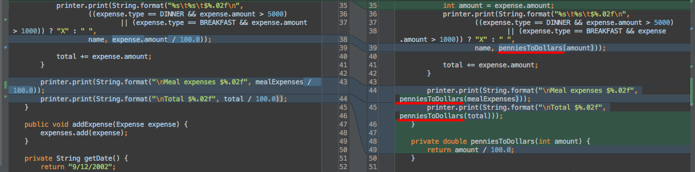
	* 파라미터 처리를 위해 extract했던 변수를 inline한다.
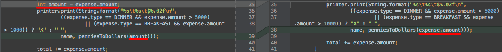

##### 2.1.2 printXXX
- 가독성을 높이고 Composed Method Pattern을 준수하기 위해 printHeader 메소드를 추출한다.

- 같은 이유로 printTotals 메소드를 추출한다.
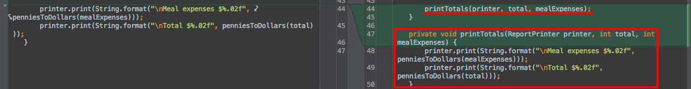
- printExpenses 메소드를 추출하고 싶다. 하지만 이 로직은 비즈니스 로직과 섞여있다.
	- 비즈니스 로직과 포맷팅 로직을 추출하기 위해 비즈니스 로직을 한 곳으로 모인다.
	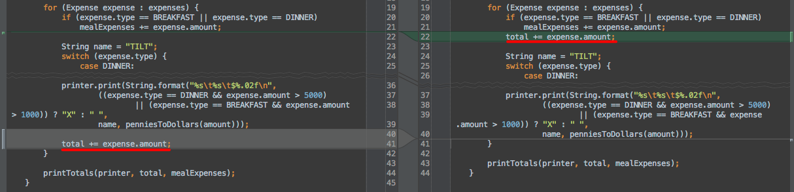
	- 비즈니스 로직과 포맷팅 로직을 분리하기 위해 for-loop를 2개로 분리한다.
	
	- printExpenses 메소드를 추출한다.
	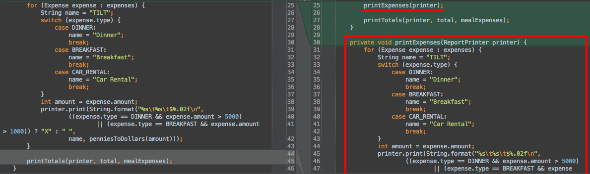
- 비즈니스 로직을 totalUpExpenses라는 메소드를 추출하고 싶으나 2개의 변수가 변경되어 extract할 수 없다.
	
	- 2개의 변수에 대해 extract field한다. 이때 constructor에서 initialize하도록 선택한다.
	
	- extract method - totalUpExpenses
	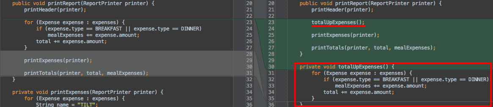

##### 2.1.3 Change Signature
- total, mealExpenses는 field로 추출했으므로 파라미터로 전달할 필요가 없다.
	

*** 보통 코드의 여러곳에 사용되는 변수들은 리팩토링 전에 field로 추출하는 작업을 선행한다. 그럼 더 편하게 리팩토링이 가능하다.***

##### 2.1.4 getName

##### 2.1.5 Create a Field for Parameter
printReport에 전달된 printer가 여러 함수에 파라미터로 전달되고 있다. 이를 field로 생성하여 파라미터 개수를 줄인다.
- Create a Field for Parameter
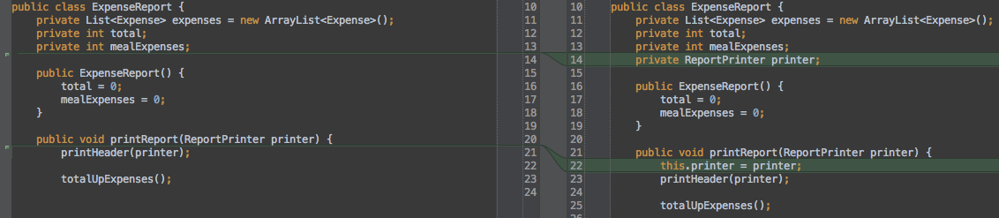
- field로 변환한 printer를 파라미터로 갖는 메소드들에 대해 change signature를 수행하여 파라미터를 제거한다.

##### 2.1.6 printExpensesAndTotals
- 이 메소드를 추출하기 위한 사전 작업으로 move line up을 수행한다.
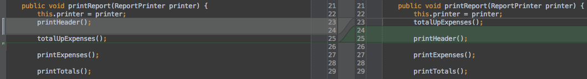
- printExpensesAndTotals 메소드를 추출한다.

##### 2.1.7 printExpense
- {}를 없애기 위해 메소드 추출
- {}는 function should do one thing을 위반하고 있다는 증후이다.

- 불필요한 변수 선언을 제거하기 위해 name을 inline한다.
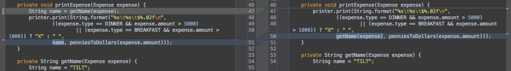

##### 2.1.8 isMeal
- 가독성을 위해 isMeal 메소드를 추출한다.
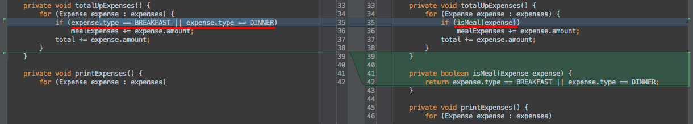

##### 2.1.9 addTotals
{}를 제거하기 위해 addTotals 메소드를 추출한다.
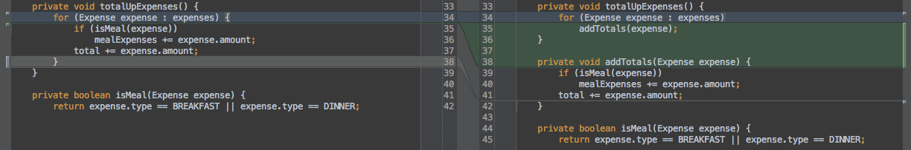

##### 2.1.10 isOverage
가독성을 위해 isOverage를 추출한다.

### 2.2 SRP 위반

##### 2.2.1 Rename
ExpenseReport에서 비즈니스 로직을 추출하여 이를 ExpeseReport라고 하기위해 지금의 ExpeseReport는 ExpeseReporter로 rename한다.

##### 2.2.2 Extract Class

- extract class할 때는 관련된 메소드/필드를 함께 추출해야 한다.
- 사용하거나 호출하는 메소드/필드를 "Members to Extract"에서 잘 선택한다.

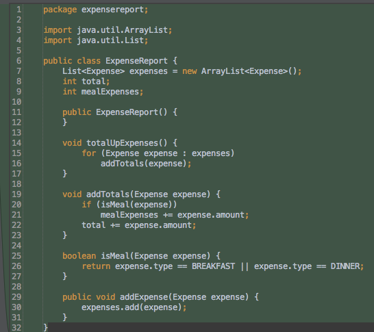

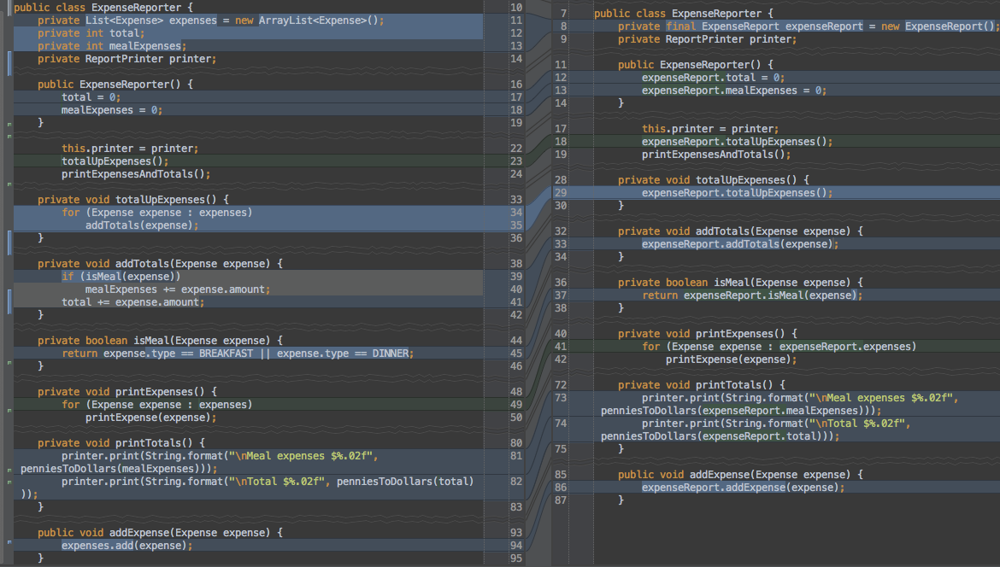

##### 2.2.3 Safely Delete Unused Methods
- extract class 후에 사용되지 않는 메소드들이 발생한다. 이를 제거한다.
- (intellJ에서는 커밋때 이런 warning이 있으면 알려주니… 커밋 전에 작업하는 것이 좋다.)
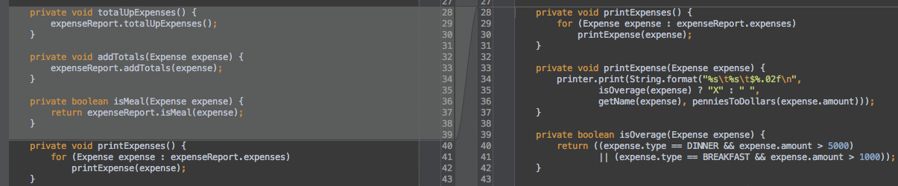

### 2.3 Feature Envy
[Feature Envy](http://en.wikipedia.org/wiki/Code_smell)인 메소드 isOverage, isMeal를 Expense 클래스로 [Move Method](http://www.refactoring.com/catalog/moveMethod.html)한다.
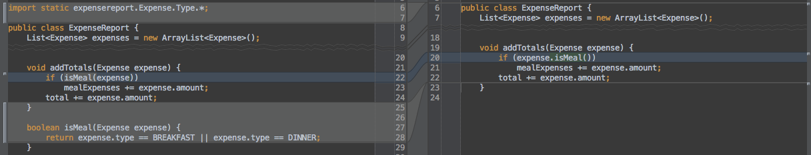

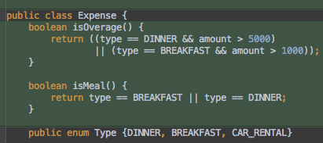

### 2.4 OCP 위반
Type에 종속적이여서 OCP를 위반하고 있다. [Replace Type Code with Subclasses](http://www.refactoring.com/catalog/replaceTypeCodeWithSubclasses.html)를 적용하자.

##### 2.4.1 Test 수정
- Test를 수정하여 Expense가 아니라 필요한 타입의 서브 클래스를 생성하도록 한다.
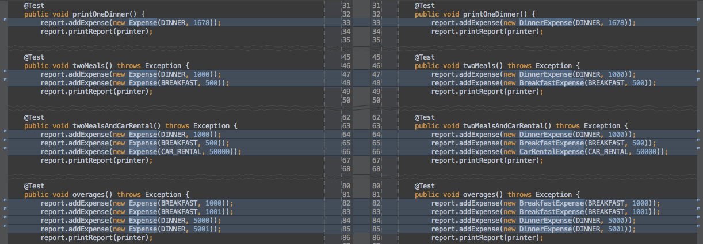
- IDE의 quick fix 기능을 이용하여 3개의 서브 클래스를 추가하고 테스트를 수행하여 성공을 확인
- 객체 생성시 파라미터로 전달하는 type(예. DINNER)과 클래스명(예. DinnerExpense)는 중복이다. 파라미터를 제거한다.
	- 테스트

	- 프로덕션

##### 2.4.2 push members down
- Expense 클래스에서 isMeal, isOverage 2개의 메소드를 선택하여
- keep abstract를 선택하여 base 클래스에는 abstract로 유지되도록

	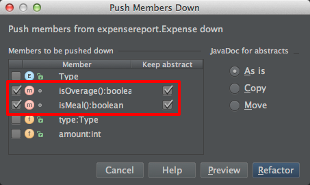
	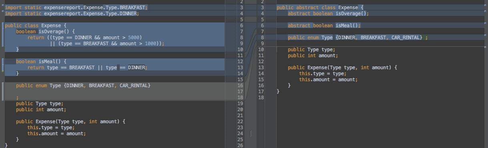
	

##### 2.4.3 타입별 수정
- isMeal, isOverage 메소드에 대해서 타입별로 수정
- 이때 코드 커버리지를 참조하면서 수행할 수도 있다.
	
	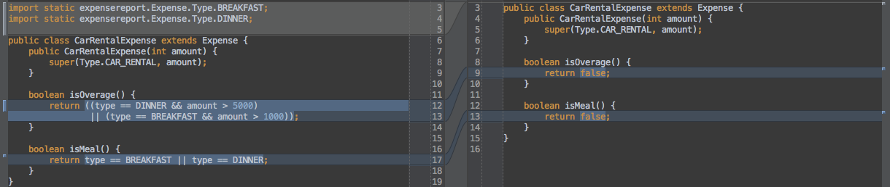
	

##### 2.4.4 Remove Type
- 더 이상 사용되지 않는 Expense.Type enum을 제거한다.
- getName 메소드에서 Type을 사용하지 않도록 수정한다.
	
	
	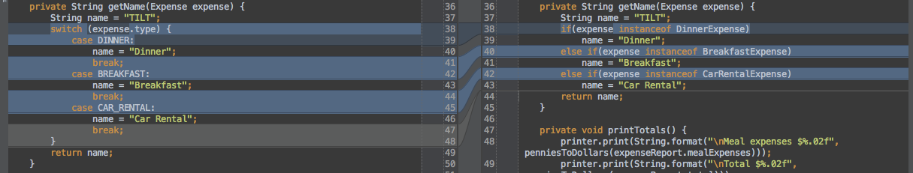

##### 2.4.5 Extract Class - ExpenseNamer
이제 새로운 타입이 추가되면 수정은 없다. 그저 Expense를 상속받는 새로운 클래스를 추가하면 된다.

하지만 ExpenseRepoter#getName는 새로운 타입이 추가될 때마다 수정되어야 한다. OCP 위반이다.

이를 새로운 클래스로 추출하고, 인터페이스를 추출하고, ExpenseRepoter가 인터페이스에 의존성을 갖게 하여 비즈니스 로직(app part)의 변경 없이 새로운 타입을 추가할 수 있도록 한다.
- Extract Class - ExpenseNamer
	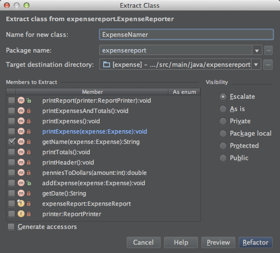
	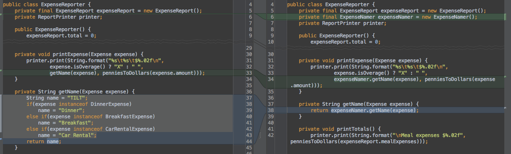
- 더 이상 사용되지 않는 ExpenseReport#getName 메소드를 safely delete한다.
- change scope of getName to public
	- extract interface를 위해 변경한다.
- extract interface
	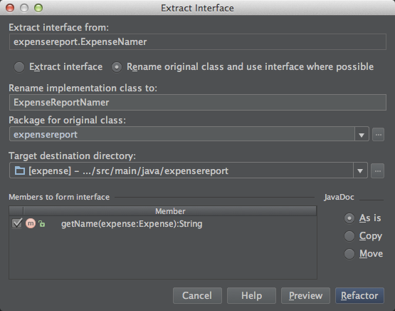
	
	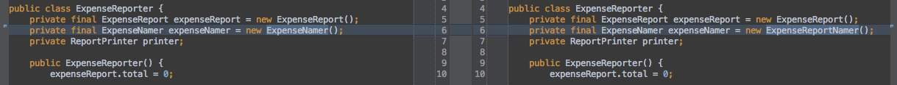
	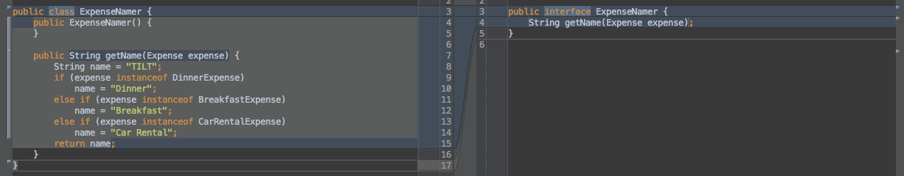

# 결론

이상의 과정에서 이와 같은 아키텍쳐를 얻었다.

- 붉은색으로 나눠진 윗 부분은 변경에 영향을 받지 않고 재사용될 수 있는 부분이고
- 아래 부분은 변경이 요구될 때 추가되어야하는 서브 클래스들과 변경되어야 할 구현체이다.

개인적으로는 getName을 Expese 클래스로 옮기면 더 좋을 것 같다는 생각이 든다.

## before

## after

* 클래스 다이어그램을 보면 복잡해 진 것 같으나, 기존 다이어그램에서 Expense가 data holder로서 객체의 역할을 수행하지 못하고 있는 것에 반해
* 리팩토링 후에는 책임(출력, 계산)이 분리되었고, Expense에 관련된 행위가 옮겨졌다. 또 다이어그램만으로 어떤 Expense들이 존재하는지 어떤 기능들이 있는지가 눈에 잘 들어온다.
* 또 데이터와 관련된 기능이 한 객체에 모이면서 내부의 변경이 외부에 영향을 주지 않게 되었다.

메일: msbaek71@gmail.com 이나 [facebook design by object 그룹](https://www.facebook.com/groups/508738095846803/)으로 의견이나 질문 받겠습니다.
